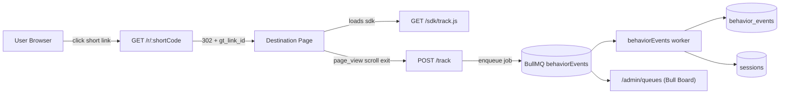

# GrowTrace Tracking SDK + BullMQ Flow

This document explains the complete end-to-end flow for GrowTrace Phase 2 tracking:

- Browser SDK event collection
- Redirect attribution (`gt_link_id`)
- Event ingestion (`POST /track`)
- BullMQ queue buffering
- Worker-side persistence into `behavior_events` and `sessions`
- Bull Board visibility and operations

---

## 1) High-Level Architecture



---

## 2) Runtime Startup Flow (Server)

`server/src/server.ts` starts all required infrastructure and worker in one process:

1. Connect MongoDB
2. Connect Redis
3. Connect RabbitMQ (existing infra still active)
4. Start BullMQ worker (`startBehaviorEventsWorker`)
5. Start HTTP server on `PORT`
6. Log Bull Board URL

Expected startup logs:

```text
DB connected successfully
Redis connected successfully
RabbitMQ connected successfully
behaviorEvents worker running (env=development, pid=...)
Server running on port 8000
Bull Board running on http://localhost:8000/admin/queues
```

---

## 3) SDK Serving + Public API

### SDK static serving

- Bundle file: `sdk/dist/track.js`
- Route: `GET /sdk/track.js`
- Served with cache headers (`max-age=3600`)

### Public API exposed in browser

```js
window.growtrace.init({ apiKey: "USER_OBJECT_ID", endpoint: "/track" });
window.growtrace.track("scroll", { scrollDepth: 72 });
```

Core SDK behavior:

- Tracks `page_view` on init
- Tracks max scroll depth with 300ms throttle
- Tracks active duration using visibility/focus/blur
- Sends `exit` on `pagehide` / hidden state using `sendBeacon` fallback to keepalive `fetch`
- Captures and persists `gt_link_id` for current session attribution
- Uses returning-user marker `gt_seen`

---

## 4) Redirect Attribution (`/r/:shortCode`)

`server/src/api/controllers/redirect.controller.ts`:

1. Resolve link by short code
2. Fire async click logging (existing behavior)
3. Append tracking query param:
   - `gt_link_id=<link._id>`
4. Redirect to destination URL with attribution param preserved

Example:

- Input destination: `https://example.com/post?utm_source=ig#hero`
- Redirect result: `https://example.com/post?utm_source=ig&gt_link_id=<id>#hero`

---

## 5) Event Ingestion Flow (`POST /track`)

Files:

- `server/src/api/routes/track.ts`
- `server/src/api/controllers/track.controller.ts`
- `server/src/api/validators/track.validator.ts`

### Request path

1. Validate payload with Zod
2. Read user-agent and bot-filter (`isLikelyBot`)
3. Resolve `apiKey -> userId` (cached in Redis with 5 min TTL)
4. Attach server metadata:
   - client IP
   - country
   - received timestamp
5. Enqueue job into BullMQ queue `behaviorEvents`
6. Return quickly with `200 { success: true }`

### Important behavior

- Unknown or deleted apiKey is silently acknowledged (returns success response, no job)
- Bot-like traffic is silently acknowledged (no job)
- No synchronous DB write is performed in controller

---

## 6) Queue and Worker Design

### Queue config

`server/src/infrastructure/queue.ts`:

- Queue name: `behaviorEvents`
- Backoff: exponential (`delay: 500`)
- Retries: `attempts: 5`
- Job retention:
  - completed: age/count limited
  - failed: retained for diagnostics

### Worker logic

`server/src/workers/behaviorEvents.worker.ts` processes each job:

1. Insert raw event into `behavior_events`
2. Update `sessions` according to event type

Per event type:

- `page_view`
  - upsert session by `sessionId`
  - set first-visit metadata on insert
  - update `lastActivityAt`
- `scroll`
  - `$max` update on `maxScrollDepth`
  - update `lastActivityAt`
- `exit`
  - `$max` update on `duration` and scroll depth
  - compute bounce (`duration < 10s`)
  - update `lastActivityAt`

---

## 7) Data Model Responsibilities

### `behavior_events`

Stores immutable event facts:

- session, user, optional link
- event type and client timestamp
- page and device context
- metrics (`scrollDepth`, `duration`)
- country

### `sessions`

Stores aggregated session-level state:

- first and last activity
- max depth / duration
- bounce classification
- returning-user flag
- attribution (`linkId`) and entry context

---

## 8) Bull Board Operations

Mounted at:

- `GET /admin/queues`
- API endpoint used by UI: `/admin/queues/api/queues`

What you can inspect:

- waiting / active / delayed / failed / completed counts
- recent jobs
- retry/failure details

Bull Board currently has no auth middleware (internal/dev-safe usage recommended).

---

## 9) End-to-End Example Sequence

1. User clicks short link `/r/abc123`
2. Server redirects to destination with `gt_link_id=...`
3. Destination page loads `track.js`
4. SDK `init()` sends `page_view`
5. User scrolls; SDK sends throttled `scroll` updates (max depth semantics)
6. User closes tab; SDK sends `exit` with duration + scroll depth
7. `/track` enqueues each event
8. Worker persists event + updates session aggregate
9. Operator observes queue health in Bull Board

---

## 10) Key Files Reference

- SDK:
  - `sdk/src/index.ts`
  - `sdk/src/session.ts`
  - `sdk/src/scroll.ts`
  - `sdk/src/time.ts`
  - `sdk/src/exit.ts`
  - `sdk/src/transport.ts`
- Server boot + routes:
  - `server/src/server.ts`
  - `server/src/api/routes/track.ts`
  - `server/src/api/controllers/track.controller.ts`
  - `server/src/api/controllers/redirect.controller.ts`
- Queue + worker:
  - `server/src/infrastructure/queue.ts`
  - `server/src/workers/behaviorEvents.worker.ts`
  - `server/src/infrastructure/bullBoard.ts`
- Models:
  - `server/src/api/models/behaviorEvent.model.ts`
  - `server/src/api/models/session.model.ts`

